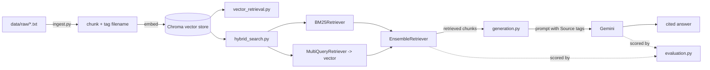

# rag-pipeline

A from-scratch Retrieval-Augmented Generation (RAG) pipeline built with LangChain, ChromaDB, and Google Gemini — built to *learn RAG by implementing every stage myself*, rather than wiring together one high-level framework helper.

The corpus is 10 short lesson files that teach RAG concepts end-to-end (`data/raw/`), so the pipeline retrieves from and explains its own subject matter — a nice side effect for demoing it.

## Why this project

I wanted hands-on proof that I understand RAG beyond the "stuff documents into a vector store and call `.invoke()`" level. Each stage below was implemented, debugged, and evaluated individually:

- **Ingestion** that tags every chunk with its source filename, not just raw text
- **Two retrieval strategies** (pure vector vs. hybrid lexical+semantic) to compare recall/precision trade-offs directly
- **Query expansion** (`MultiQueryRetriever`) to handle the gap between how a user phrases a question and how the corpus phrases the answer
- **Citation-grounded generation** — the model is instructed to cite its sources and say "I don't know" rather than hallucinate
- **Retrieval vs. generation evaluation kept separate** (per `data/raw/08_rag_evaluation.txt`), instead of eyeballing "does the answer sound good?"

## Architecture



## How this maps to the RAG pipeline

| # | Stage | File | Status |
| --- | --- | --- | --- |
| 1-4 | Load → chunk → embed → store (tags each chunk with its source filename) | `src/pipeline/ingest.py` | done |
| 5a | Semantic (vector) retrieval | `src/pipeline/vector_retrieval.py` | done |
| 5b | Hybrid retrieval (BM25 + multi-query-expanded vector ensemble) | `src/pipeline/hybrid_search.py` | done |
| 6-7 | Prompt construction (with per-source citations) + LLM generation | `src/pipeline/generation.py` | done |
| 8 | Evaluation (retrieval accuracy vs. generation accuracy, scored separately) | `src/pipeline/evaluation.py` | done |
| 9 | Metadata filtering (filter retrieval by source/filename) | — | not started |
| — | Shared config (API key, models, constants) | `src/pipeline/config.py` | done |
| — | API layer | — | not started |

Read `data/raw/` in order (01 → 10) alongside the code — each lesson explains the concept the next script implements.

## Features

- **Source citations.** Every ingested chunk is tagged with its originating `filename` as metadata. `generation.py` surfaces this to the LLM as `[Source: ...]` blocks and instructs it to cite the filename after every claim, so answers stay traceable back to the lesson file they came from.
- **Multi-query retrieval.** The vector leg of the hybrid ensemble in `hybrid_search.py` is wrapped in `MultiQueryRetriever`, which asks the Gemini chat model to rephrase the question a few different ways and unions the results — improving recall when the question's wording doesn't match the corpus's wording.
- **Separated evaluation.** `evaluation.py` runs a fixed set of question → expected-source pairs and scores retrieval (did the right file get retrieved?) and generation (does the answer contain the expected concept?) independently, instead of a single subjective "looks right" judgment.
- **Per-function error identification.** Every pipeline function (`ingest`, `chunk`, `ingest_pipeline`, `hybrid_search`, `call_google_api`, `format_context`) wraps its body in try/except, printing a `[function_name] error: ...` message before re-raising, so failures are easy to trace to their origin.

## Layout

```
rag-pipeline/
├── LICENSE
├── .env.example              # template for required/optional settings
├── .gitignore
├── requirements.txt
├── README.md
├── data/
│   └── raw/                  # 10-lesson RAG corpus (committed)
└── src/
    ├── __init__.py
    └── pipeline/
        ├── __init__.py
        ├── config.py           # API key + all tunable constants, read from .env
        ├── ingest.py           # load -> chunk -> embed -> persist
        ├── vector_retrieval.py # semantic (vector-only) retrieval
        ├── hybrid_search.py    # BM25 + multi-query-expanded vector ensemble
        ├── generation.py       # retrieve -> cited prompt -> Gemini generation
        └── evaluation.py       # retrieval-vs-generation accuracy scorecard
```

Generated artifacts (`.venv/`, `chroma_gemini_db/`, `__pycache__/`) are gitignored and not part of the source tree.

## Configuration

Every script reads its settings from `config.py` instead of hardcoding them, so you can experiment (different model, chunk size, top-k, collection) by editing `.env` only:

| Variable | Default | Meaning |
| --- | --- | --- |
| `GOOGLE_API_KEY` | *(required)* | Google AI Studio key, used for both embeddings and generation |
| `EMBEDDING_MODEL` | `models/gemini-embedding-001` | Embedding model for ingestion + retrieval |
| `GENERATION_MODEL` | `gemini-3.5-flash` | Chat model used to generate answers |
| `COLLECTION_NAME` | `gemini_collection` | Chroma collection name |
| `PERSIST_DIRECTORY` | `./chroma_gemini_db` | Where the vector store is written/read |
| `CHUNK_SIZE` | `1000` | Characters per chunk during ingestion |
| `RETRIEVAL_K` | `3` | Top-k results returned by each retriever |

## Setup

```bash
python -m venv .venv
.venv\Scripts\activate          # Windows
pip install -r requirements.txt
copy .env.example .env          # then paste your GOOGLE_API_KEY
```

## Usage

Run everything from `src/pipeline/` — see known issue #1 below for why the working directory matters.

```bash
# 1. Build the vector store (calls the Gemini embeddings API)
python ingest.py

# 2. Query it
python vector_retrieval.py
python hybrid_search.py

# 3. Ask a question and get a generated, cited answer
python generation.py

# 4. Score retrieval accuracy vs. generation accuracy
python evaluation.py
```

### Example output

```
$ python generation.py
Enter your question: What is the difference between chunk size and overlap?

Chunk size controls how large each split of a document is, while overlap controls how much
text is repeated between consecutive chunks so context isn't lost at the boundary
(Source: 03_chunking.txt).
```

```
$ python evaluation.py
Question                                                     Retrieval  Generation
----------------------------------------------------------------------------------
What is the difference between chunk size and overlap?       True       True
How does a vector database find similar embeddings?          True       True
What does the retriever stage do in a RAG pipeline?          True       True
How should a prompt be constructed for the generation stag   True       True
Why should retrieval and generation quality be evaluated s   True       True
----------------------------------------------------------------------------------
Retrieval accuracy:  5/5
Generation accuracy: 5/5
```

## Known issues

These are real bugs in the current code, tracked here rather than fixed, so they are not lost. Fixing them is a good next exercise:

1. **Relative `PERSIST_DIRECTORY`.** The default (`./chroma_gemini_db`) resolves against the current working directory, not the script location. Ingesting from the repo root writes the store to the root; querying from `src/pipeline` reads a different, possibly empty store. Always run from a consistent directory, or fix `config.py` to derive an absolute path.
2. **Re-ingest duplicates data.** `ingest_pipeline` appends into the existing collection with no reset or deterministic IDs. Running it twice doubles the corpus. Delete `chroma_gemini_db/` before re-ingesting.
3. **Import-time side effects.** `vector_retrieval.py` executes its query at module level with no `if __name__ == "__main__":` guard, so importing it costs an embedding API call.
4. **No relevance floor.** Retrieval returns top-k unconditionally with no score threshold, so unrelated questions still return chunks and get passed to the LLM.
5. **Older chunks may lack `filename` metadata.** Chunks ingested before the citation feature was added only have `source`, not `filename`. `format_context` and `evaluation.py` both fall back to deriving the name from `source`, but re-running `ingest.py` against a fresh store is the proper fix.
6. **Multi-query adds latency/cost.** `MultiQueryRetriever` issues an extra LLM call per query to generate rephrasings, so every `hybrid_search()` call is slower and costs more than a plain vector search.
7. **No automated test suite.** `evaluation.py` checks pipeline *behavior* against expected sources/keywords, but there's no pytest suite asserting things like chunk counts or error-handling paths.

## Possible next steps

Not required to call this project "done," but natural extensions if revisited:

- Metadata filtering (lesson 09): let a query restrict retrieval to a specific source file
- A thin FastAPI layer exposing `/ask` so the pipeline is callable over HTTP, not just as scripts
- Deterministic chunk IDs on ingestion so re-running `ingest.py` updates instead of duplicates

